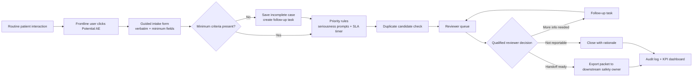
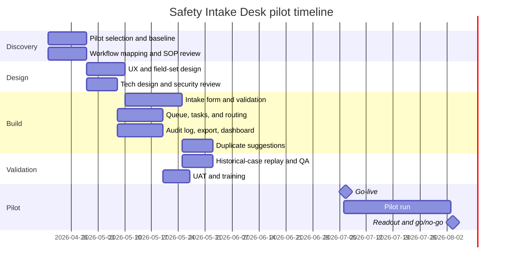

# v1 Plan for Adverse Event Intake and Triage

## Executive summary

The right v1 is not a full pharmacovigilance platform. It is a narrow internal workflow product, **Safety Intake Desk**, that sits at the first point where potential drug-related adverse events surface during routine patient-support interactions, captures the minimum required facts in a structured way, routes the case to a human reviewer, and produces an audit-ready handoff to the downstream safety owner. That recommendation matches the uploaded brief’s constraints, which explicitly call for a workflow-support product, human-in-the-loop review, and clear scope discipline rather than an all-in-one system. It also matches BioScript’s public operating model: the company provides patient support programs, specialty pharmacy, and clinics across entity["country","Canada","north american country"]; it says those teams stay in regular contact with patients, monitor health, and already run trained pharmacovigilance and proprietary data systems; and entity["organization","Health Canada","federal regulator canada"] treats patient-support and disease-management interactions as a valid source of solicited adverse reaction reports that require minimum case data, qualified review, follow-up, and audit-ready records. fileciteturn0file0 citeturn10view0turn10view1turn10view2turn17view1turn6view0turn5view3turn6view1

| Item | Recommendation |
|---|---|
| Exact v1 | **Safety Intake Desk**: an embedded first-mile capture, triage, and handoff workbench for potential adverse events |
| Best pilot | One phone-based patient support program for a self-administered specialty or biologic therapy |
| Build shape | Sidecar workflow module with SSO and metadata lookup into existing systems, not a core-platform rewrite |
| Timeline | 12 to 16 weeks to pilot, then 4 weeks of measured evaluation |
| Budget | **Recommended medium scenario:** CAD 280k to 420k build, CAD 100k to 160k annual run |
| What it proves | Fast scoping, real ops insight, compliance-aware product judgment, practical technical choices |

## Context and problem framing

### Constraints from the brief

The uploaded brief resolves the otherwise-unspecified project into a specific assignment: design a narrow BioScript v1 that improves how potential adverse events from drug-related interactions are captured, structured, triaged, and handed off for review, while **not** building a full pharmacovigilance platform and **not** automating medical or regulatory decisions. fileciteturn0file0

### Verified facts and assumptions

| Type | Statement | Planning implication |
|---|---|---|
| Verified | BioScript publicly says it provides patient support programs, specialty pharmacy, clinics and nursing, supports patients, manufacturers, prescribers, and payors, and has more than 1,400 team members across the country. citeturn10view0turn10view2turn17view1 | The operating model is multi-channel and national, but v1 should not launch everywhere at once. |
| Verified | BioScript says its patient support teams connect with patients right away, stay regularly in touch, monitor health, coordinate reimbursement and appointments, and support therapy adherence. citeturn10view0turn10view2turn10view3 | Routine patient contact is the highest-leverage place to improve first-mile adverse-event capture. |
| Verified | BioScript says its pharmacovigilance team is trained in adverse event monitoring and reporting and delivers timely, audit-ready reporting. citeturn10view0 | v1 should support that team, not replace it. |
| Verified | BioScript says it maintains a custom-built database and proprietary pharmacy software that integrates with leading pharmacy management systems. citeturn10view0turn10view1 | The fastest implementation is an adjacent workflow layer that reuses current systems and identity. |
| Verified | Health Canada guidance says reports from patient support and disease-management programs are **solicited reports**. They should be reported when there is a reasonable possibility the product caused the reaction, as determined by a qualified health care professional, and cases need the minimum four criteria: identifiable reporter, identifiable patient, suspect product, and adverse reaction. citeturn6view0turn5view3 | v1 must capture minimum reportability facts and preserve a clear human review checkpoint. |
| Verified | Health Canada recommends follow-up for serious cases, preserving reporter verbatim language, using MedDRA for coding, explicit contractual exchange responsibilities, and records that are audit-accessible. citeturn6view1 | v1 must separate verbatim capture from reviewer assessment, task follow-up, and maintain an audit trail. |
| Assumption | Today, potential adverse events are often buried in free-text notes, general CRM records, email threads, or manual handoffs. | This is the core workflow gap the product addresses. |
| Assumption | A downstream safety owner already exists, either inside BioScript’s pharmacovigilance function or with a manufacturer / MAH partner. | v1 should export clean handoff packages, not own end-to-end regulatory submission. |
| Assumption | The pilot can start in one English-first program and one primary intake channel. | This keeps delivery realistic and speeds learning. |
| Assumption | Existing SSO, patient/program metadata, and secure hosting are already available internally. | This keeps the budget and timeline credible. |

### Problem definition

**The exact v1 problem** is this: during routine patient support calls, refill reminders, adherence outreach, clinic follow-ups, or pharmacy contacts, frontline staff may learn about a possible drug-related adverse event, but the information is often captured as narrative operational notes rather than as a structured, safety-ready intake. That creates four downstream problems at once: missing minimum case facts, uncertain urgency, manual reviewer rework, and weak auditability. BioScript’s operating model makes this especially relevant because the company explicitly stays in active contact with patients, monitors health, and supports specialty and biologic therapies with known risks and side effects. citeturn10view0turn10view1turn10view2turn10view3

Operationally, this matters because Health Canada defines serious adverse reactions to include hospitalization, significant disability or incapacity, congenital malformation, life-threatening events, or death, and expects reportable cases to have minimum case criteria even if the full medical picture is still incomplete. For serious cases, follow-up should continue until outcome is established or the condition is stabilized. In other words, weak intake is not just bad documentation. It directly increases the chance of delay, rework, or poor-quality handoff in a time-sensitive workflow. citeturn18view0turn5view3turn6view1

This is a better v1 than building a full pharmacovigilance system because BioScript already says it has trained pharmacovigilance capability and existing proprietary data systems. A true end-state PV platform would quickly expand into broader case-management governance, MedDRA tooling, transmission standards such as E2B(R3), duplicate-management workflows, aggregate reporting, and integration with external safety owners. That is real work, but it is the wrong first wedge if the immediate bottleneck is **first-mile capture and handoff quality**. citeturn10view0turn10view1turn0search1turn16view2

### Why this wedge is right

| Option | What it solves | Time to value | Main problem | Verdict |
|---|---|---:|---|---|
| Full PV platform | Intake, case processing, coding, submissions, broader reporting | Slow | Too broad for a first build; duplicates downstream capabilities; high validation burden | No |
| Generic incident form | Faster documentation | Fast | Still leaves triage, follow-up, dedupe, audit package creation, and role clarity unresolved | No |
| **Safety Intake Desk** | Structured intake, triage queue, follow-up, dedupe suggestions, handoff package, audit trail | **Fast enough to pilot** | Still depends on downstream safety owner, but that is acceptable in v1 | **Yes** |

This wedge is right because it sits exactly where BioScript’s service model creates both risk and value: ongoing patient contact. It uses current systems instead of fighting them, improves the quality of what reaches the safety function, and avoids pretending that the first useful product must also own final regulatory transmission. That is disciplined scope, not incomplete thinking. citeturn10view0turn10view1turn17view0turn20view0

## Users, product, and scope

### Target users and stakeholders

The user landscape below is inferred from BioScript’s public service model and the brief’s human-in-the-loop constraints. fileciteturn0file0 citeturn10view0turn10view1turn10view2turn10view3

| Role | Type | Pain points | What success looks like |
|---|---|---|---|
| Patient support coordinators / case managers | Primary user | Hear possible events during calls, but are not safety specialists; need to move fast without missing key facts | 2 to 3 minute intake, little ambiguity, clear next step |
| Nurses / field coordinators | Primary user | Need to record medically meaningful detail while still managing care tasks | Structured capture without duplicate documentation |
| Specialty pharmacists | Primary user | Need to capture side-effect or adherence issues surfaced during refill / counselling interactions | One-click safety intake from the patient record |
| Pharmacovigilance reviewer / qualified reviewer | Secondary user | Receives incomplete or inconsistent notes and spends time reconstructing the case | Queue of structured cases with missing-data tasks and traceable source notes |
| Program manager / operations lead | Secondary user | Limited visibility into backlog, SLAs, and rework sources | Dashboard showing queue health and recurring failure points |
| Quality / compliance lead | Secondary user | Needs evidence of process control, auditability, and role separation | Clear SOP alignment, records, and access logs |
| Operations sponsor | Buyer / stakeholder | Wants lower admin burden and cleaner execution without buying a giant platform | Pilot proves operational value quickly |
| Digital / IT lead | Stakeholder | Wants low-risk architecture, contained integrations, and supportable scope | Sidecar module, not platform sprawl |
| Manufacturer / MAH partner | External stakeholder | Wants timely, accurate handoff and less back-and-forth | Cleaner intake packages and faster turnaround |

### Proposed v1

**Working title:** **Safety Intake Desk**

**One-sentence value proposition:**  
Capture potential adverse events at the moment they surface, enforce the minimum case facts needed for review, and hand off a clean, auditable package to the safety owner without building a full pharmacovigilance system.

The core workflow is intentionally narrow: a frontline user flags a potential adverse event during a routine interaction; the product captures verbatim plus minimum structured fields; rules assign urgency and create missing-information tasks; a human reviewer decides what to follow up, what is handoff-ready, and what is not reportable; and the system produces an exportable package with a complete audit trail. That design directly reflects the brief’s human-in-the-loop constraint and Health Canada’s expectations around minimum criteria, follow-up, and qualified review. fileciteturn0file0 citeturn5view3turn6view0turn6view1

| Key feature | What it does | Why it stays in scope |
|---|---|---|
| Embedded **Potential AE** action | Starts intake from the existing patient/program context | Removes the “where do I put this?” problem |
| Guided intake form | Captures verbatim narrative plus a small set of structured fields | Fixes first-mile quality without making the form oppressive |
| Seriousness prompts and SLA timer | Flags possible urgency based on predefined criteria | Supports triage without automating clinical judgment |
| Follow-up tasking | Creates owner, due date, and missing-data checklist | Reduces reviewer rework and dropped cases |
| Reviewer queue | Assigns cases to the right human reviewer with clear statuses | Preserves role separation and accountability |
| Duplicate suggestions | Shows likely case matches using patient/program/date/product similarity | Lowers duplicate burden without auto-merging |
| Handoff packet export | Creates PDF / CSV / secure payload for downstream processing | Delivers value even if external systems remain unchanged |
| Audit log and ops dashboard | Tracks actions, timestamps, and queue metrics | Makes the pilot measurable and auditable |

### Business requirements to technical design

The mapping below is anchored in BioScript’s public operating model, Health Canada’s guidance on solicited reports, minimum criteria, follow-up, records, and contractual responsibilities, the 2026 duplicate-burden notice, and privacy safeguards under PIPEDA. citeturn10view0turn10view1turn10view2turn5view3turn6view0turn6view1turn20view0turn13view0turn13view1

| Business requirement | Why it matters | v1 feature / workflow | Technical implementation choice | Tradeoff / limitation |
|---|---|---|---|---|
| Capture potential events during routine patient contact with minimal friction | BioScript’s teams stay regularly in touch with patients and monitor health, so the highest-yield capture point is routine operational interaction. citeturn10view0turn10view2 | Embedded **Potential AE** action in the existing patient/program record | Sidecar web component launched with patient and program context prefilled | Requires at least lightweight integration or context passing from the source system |
| Preserve minimum reportability facts | Health Canada requires identifiable reporter, identifiable patient, suspect product, and adverse reaction as minimum case criteria. citeturn5view3 | Guided intake form with hard-required fields and save-incomplete mode | Required-field validation plus status = `incomplete` when key fields are missing | Does not itself determine final reportability |
| Keep source wording intact | Health Canada recommends retaining reporter verbatim language and avoiding inference in initial capture. citeturn6view1 | Immutable verbatim note snapshot plus separate reviewer-assessed fields | Append-only source-note object stored alongside structured fields | Reviewers still need to interpret messy narratives |
| Route potentially serious cases fast | Serious reactions include hospitalization, disability, life-threatening events, congenital malformation, or death. citeturn18view0 | Seriousness prompts and priority queue | Rule-based urgency scoring and SLA clock | Rules may over-trigger; reviewer still needed |
| Keep humans in the loop for medical / causality judgment | Solicited reports should be submitted only when there is a reasonable possibility, as determined by a qualified health care professional. citeturn6view0 | Reviewer queue with explicit decision states | Role-based workflow with reviewer-only fields | Adds one review step by design; that is intentional |
| Support follow-up on incomplete or serious cases | Health Canada recommends targeted follow-up, especially for serious cases, until outcome or stabilization. citeturn6view1 | Missing-information tasks with due dates and owners | Task entity tied to the case record and SLA reminders | More operational discipline required from teams |
| Reduce duplicate case work | Health Canada’s 2026 notice says current guidance had created significant duplicate reporting and industry burden. citeturn20view0 | Duplicate-candidate pane before handoff | Deterministic + fuzzy matching on patient/program/date/product/event text | No auto-merge in v1; humans confirm |
| Produce audit-ready records | Health Canada guidance recommends explicit exchange responsibilities and records accessible for audit, with long retention expectations. citeturn6view1 | Handoff packet, status history, export log, immutable timestamps | Append-only audit journal and document versioning | Retention policy must be defined before scale |
| Protect sensitive health information | PIPEDA requires safeguards appropriate to sensitive information and need-to-know access. citeturn13view0turn13view1 | Program-scoped permissions, masking, encryption | Enterprise SSO, RBAC, field masking, encrypted storage | Some users may lose broad visibility they are used to |
| Allow program-specific tailoring without custom code every time | BioScript says it tailors touchpoints to patient and medication profiles and operates a custom-built database. citeturn10view0turn10view1 | Configurable field templates for one pilot program | Admin-configurable form schema and rule thresholds | Not a full no-code workflow builder in v1 |

### Scope

| In scope | Out of scope | Deferred to v2 |
|---|---|---|
| One pilot program | Full pharmacovigilance platform | Expansion to more programs |
| One primary intake channel: patient-support interactions | Direct regulatory submission to Health Canada | API handoff to external safety systems |
| Guided intake form with minimum required facts | Autonomous seriousness, coding, or causality decisions | Additional intake channels such as email or telephony ingestion |
| Reviewer queue and follow-up tasks | Literature monitoring | Embedded MedDRA browser if not already licensed internally |
| Basic duplicate suggestions | Signal detection / aggregate reporting / PSUR work | Deeper dedupe and merge workflows |
| Export packet for downstream owner | Replacing the existing BioScript data layer | Full bilingual UX if the pilot does not require it |
| Audit log and KPI dashboard | Major pharmacy-core rewrite | Program template library |

The strict scope call is deliberate: **first-mile capture and handoff only**. That is the narrowest product that still solves a real operational problem.

## Delivery plan and operating model

### Implementation steps and work breakdown structure

| Workstream | Tasks and subtasks | Deliverables | Owner |
|---|---|---|---|
| Discovery and baseline | Select pilot program; map current-state workflow; identify intake points; baseline completion, rework, and turnaround metrics | Current-state map; baseline metric pack; pilot charter | Product lead + ops lead |
| Compliance and policy alignment | Confirm what counts as “potential AE” at intake; define reviewer roles; agree internal SLAs; decide system-of-record boundaries | v1 process policy; role matrix; SLA definitions | PV/compliance lead |
| Product design | Design intake screen; define statuses; design reviewer queue; specify handoff packet; write acceptance criteria | UX prototype; workflow spec; acceptance criteria | Product + design |
| Data and architecture | Define minimal data model; map source-system context fields; design SSO, audit log, exports, permissions | Data dictionary; architecture note; security checklist | Engineering lead |
| Build | Build intake form; queue; tasks; duplicate suggestions; audit log; export; dashboard; notifications | Working v1 application | Engineering |
| Validation | Test with de-identified historical cases; role-based access tests; dry-run audit retrieval; UAT; SOP and training updates | UAT sign-off; test report; training pack | QA + ops + compliance |
| Pilot launch | Roll out to one program; run office hours; review daily in week one; review weekly thereafter | Pilot go-live; issue log | Ops lead + product lead |
| Evaluation | Measure against kill / validate criteria; document defects and process gaps; decide expand, iterate, or stop | Pilot readout; go/no-go decision | Executive sponsor + core team |

### Timeline and milestones

The schedule below is the fastest plausible **recommended** path for a contained pilot, assuming existing identity and hosting can be reused.

| Milestone | Dependency | Exit criteria |
|---|---|---|
| Scope lock | Discovery complete | Pilot program agreed; field set and statuses approved |
| Build complete | Design complete | Intake, queue, tasks, export, and audit log working end to end |
| UAT sign-off | Build complete | Redacted historical cases pass and users can complete core tasks |
| Pilot go-live | UAT + training | Frontline users trained; reviewer coverage scheduled; dashboard live |
| Go / no-go decision | Pilot run complete | KPI scorecard and defect review complete |

### Resource plan and budget

**Budget assumptions:** CAD currency; blended internal / contractor loaded rates; existing hosting, authentication, and source systems already available; no new enterprise PV suite purchase in v1.

| Role | Recommended effort during build | Core responsibility |
|---|---:|---|
| Product lead | 0.5 FTE | Scope, requirements, pilot readout |
| Operations lead | 0.3 FTE | Current-state workflow, training, adoption |
| PV/compliance lead | 0.2 to 0.3 FTE | Policy, role boundaries, acceptance |
| Engineering lead | 1.0 FTE | System design and delivery |
| Full-stack engineer | 1.0 FTE | App build and integrations |
| QA / analyst | 0.3 FTE | Historical-case replay, testing, KPI instrumentation |
| Designer | 0.2 FTE | Low-friction UI for frontline staff |
| Security / IT partner | 0.1 FTE | SSO, access, review |

| Scenario | What is included | Build budget | Annual run budget | When to choose |
|---|---|---:|---:|---|
| Low | Manual export, minimal integration, one engineer plus shared product support | CAD 140k to 220k | CAD 50k to 80k | Only if BioScript wants the cheapest learning vehicle |
| **Medium** | **Recommended** sidecar module, SSO, metadata lookup, queue, tasks, export, dashboard, basic dedupe | **CAD 280k to 420k** | **CAD 100k to 160k** | Best balance of speed, credibility, and usefulness |
| High | Deeper integrations, bilingual UX, richer analytics, API handoff, heavier validation | CAD 550k to 850k | CAD 180k to 300k | Only after the wedge proves real value |

### Communication plan

| Audience | Purpose | Cadence | Format | Owner |
|---|---|---|---|---|
| Core squad | Resolve blockers and track build | Twice weekly | Standup | Product lead |
| Ops + PV leads | Validate workflow, edge cases, and policy fit | Weekly | Working session | Product lead |
| Executive sponsor | Confirm scope, timeline, and decisions | Biweekly | Steering review | Product lead |
| Pilot users | Prepare for launch and capture issues | Weekly pre-launch, then twice weekly in pilot month one | Training + office hours | Ops lead |
| Compliance / security | Review controls and exceptions | At design sign-off and pre-launch | Review checkpoint | PV/compliance lead |
| Pilot readout group | Decide expand / iterate / stop | End of pilot | KPI readout | Executive sponsor |

## Data, architecture, and compliance

### Minimum data model

The minimum data model should be driven by Health Canada’s minimum case criteria and key data elements, but kept lean enough for fast adoption in a frontline workflow. The point is not to reproduce a full case-safety database. It is to capture the minimum reliable intake object and what is needed to review and hand it off. citeturn5view3turn6view1

| Entity | Essential fields for v1 |
|---|---|
| Case intake | case_id, program_id, source_channel, first_received_at, captured_by_user, current_status, priority, duplicate_candidate_flag |
| Patient reference | internal_patient_id, age or DOB if needed, sex/gender if available, province, care setting |
| Reporter | reporter_type, reporter_name_or_token, callback_allowed, reporter_contact_if permitted |
| Suspect product | product_name, active_ingredient if known, dosage_form, strength, dose/regimen, route, indication, start_date, stop_date |
| Reaction | verbatim_description, onset_date, seriousness_flags, outcome, hospitalization_flag, life_threatening_flag, disability_flag, congenital_anomaly_flag, death_flag |
| Clinical context | concomitant_products, relevant_history, diagnostic_tests_if known, dechallenge_rechallenge_if known |
| Follow-up task | task_id, related_case_id, missing_information_type, owner, due_date, status, resolution_note |
| Review decision | reviewer_id, review_started_at, decision, rationale, handoff_ready_at, downstream_owner, downstream_reference |
| Attachment / source note | file_ref, note_snapshot, created_at, immutable_hash |
| Audit event | actor_id, action_type, before_state_ref, after_state_ref, timestamp |

A good privacy choice in v1 is to store **references** to patient/program records wherever possible, rather than duplicating broad patient datasets into a new database.

### Technical architecture

BioScript already says it has a custom-built database and proprietary software platform. The practical choice is therefore a **sidecar workflow service** that reuses those systems for context and identity instead of changing core operational software on day one. That is the best speed-to-value and risk posture. citeturn10view0turn10view1

| Layer | Lean v1 choice | Why this is the practical choice |
|---|---|---|
| Input layer | Embedded launch action from current patient/program record plus secure fallback web form | Keeps frontline users in their existing workflow |
| Application logic | Small service for validation, priority rules, task creation, duplicate suggestions, and status transitions | Contains safety-specific logic without rewriting core systems |
| Storage | Relational database for safety workflow objects; object storage for attachments; references to source systems for broader patient context | Minimizes duplicated PHI and keeps the schema manageable |
| Audit trail | Append-only event journal and immutable source-note snapshots | Supports auditability and reconstruction of case history |
| Queue / review workflow | Reviewer workboard with statuses: new, incomplete, awaiting review, follow-up, handoff ready, handed off, closed | Makes work visible and measurable |
| Reporting / export | PDF summary, CSV extract, and secure file/API stub for later | Useful immediately even if downstream systems do not change |
| Permissions / privacy | Enterprise SSO, role-based access, program scoping, field masking, encryption at rest and in transit | Aligns with sensitive health-information handling |
| Notifications | Existing enterprise email / collaboration notifications | Avoids unnecessary messaging-stack buildout |

### Procurement and legal considerations

Health Canada guidance says contractual agreements should clearly define safety-information exchange processes, timelines, and reporting responsibilities, and that the MAH remains ultimately responsible for reporting. The same guidance recommends retaining records long enough to support audit, with a 25-year retention period recommended and records accessible within 72 hours. On privacy, the entity["organization","Office of the Privacy Commissioner of Canada","privacy regulator canada"] states that PIPEDA applies to private-sector organizations engaged in commercial activity across Canada, that substantially similar provincial health-privacy regimes may apply in some provinces, and that organizations must protect sensitive information with safeguards appropriate to the risk, including limiting access on a need-to-know basis. citeturn6view1turn13view0turn13view1turn13view3

| Topic | v1 decision | Why |
|---|---|---|
| Build vs buy | Build a sidecar workflow module | Buying a full PV suite is overkill; rewriting core systems is unnecessary |
| Identity | Reuse existing enterprise SSO | Faster, safer, lower training burden |
| Hosting | Use an already approved cloud / internal environment | Avoid new procurement drag |
| Data-processing terms | Update internal and partner process documents if the pilot changes who sees or exports safety information | Clarifies responsibility and audit boundaries |
| Record retention | Decide whether v1 is system of record or a staging layer before launch | Avoid accidental retention-policy gaps |
| MedDRA / coding | Do not add new coding tooling unless already licensed | Preserve verbatim in v1; coding can remain reviewer or downstream work |
| Privacy review | Run a focused privacy and access review before UAT sign-off | Sensitive information is involved even in a narrow pilot |
| Canadian data residency | Confirm sponsor and provincial obligations for the pilot program | Contractual terms may be stricter than the general legal minimum |

### Quality assurance and KPIs

**Quality assurance plan**

| QA activity | Purpose | Exit criterion |
|---|---|---|
| Requirements traceability | Ensure each business requirement maps to a tested behavior | Every v1 requirement linked to acceptance tests |
| Historical-case replay | Test against de-identified real-world examples | 30 to 50 cases run successfully |
| Access-control testing | Verify least-privilege permissions | No unauthorized access path remains |
| Audit reconstruction drill | Prove the team can recreate a case history fast | Full case history available from logs and artifacts |
| Serious-case dry run | Test high-priority routing and reviewer response | Reviewer notified and case routed within SLA |
| UAT with frontline users | Confirm low-friction real-world usability | Typical intake completed in under 3 minutes |

**Success metrics**

Baseline values are assumed unknown at the start and should be captured during discovery.

| KPI | Why it matters | Pilot target |
|---|---|---:|
| First-pass completeness rate | Measures how often cases arrive with the core facts needed for review | ≥ 90% |
| Median intake time | Tests whether frontline users will actually adopt the tool | ≤ 3 minutes |
| Median time from intake to reviewer assignment | Measures queue responsiveness | ≤ 1 hour for serious-flagged, ≤ 1 business day otherwise |
| Reviewer rework rate | Shows whether the product is reducing manual reconstruction | 30% reduction from baseline |
| Duplicate handoff rate | Measures data hygiene before downstream transfer | < 5% |
| Follow-up task closure rate | Tests whether missing information is actually resolved | ≥ 80% within SLA |
| Audit retrieval speed | Tests operational readiness | Full case package retrievable within 15 minutes |
| Eligible-user adoption | Tests whether the workflow is sticky enough to matter | ≥ 80% of pilot users using the tool for eligible events |

## Pilot, risks, and long-term operation

### Pilot plan

The fastest plausible pilot is **one phone-based patient support program for a self-administered specialty or biologic therapy**, using patient-support staff as intake users and a small number of trained reviewers for triage and handoff. That choice fits BioScript’s publicly described patient-support and pharmacy model, which emphasizes frequent outreach, adherence support, and side-effect discussions, while avoiding a broader clinic or telephony integration program at the start. citeturn10view0turn10view1turn10view3

| Pilot element | Recommendation |
|---|---|
| Who uses it | 8 to 15 frontline pilot users, 1 to 2 reviewers, 1 program manager |
| Start channel | Routine patient-support interactions and follow-up calls |
| Program type | Self-administered specialty / biologic therapy with regular check-ins |
| Why this start point | High enough interaction volume, lower integration burden, clearer operational workflow |
| Pilot duration | 4 weeks live after build and UAT |
| Validate if | Completeness improves sharply, reviewer rework drops, users keep using it, and no material privacy/compliance issues emerge |
| Kill if | Frontline friction is too high, rework does not fall, serious-case routing fails, or policy owners do not trust the records |

### Risk register

| Risk category | Risk | Mitigation | Owner |
|---|---|---|---|
| Operational | Users keep writing into free text and ignore the new workflow | Embed launch in current record, train with real examples, track usage by team | Ops lead |
| Compliance | Frontline staff confuse “potential event” with final reportability | Use explicit labels, reviewer-only decision states, and SOP training | PV/compliance lead |
| UX | Intake form becomes too long and staff resist it | Keep only the minimum required fields; use save-incomplete mode | Product lead |
| Adoption | Pilot program volume is too low to prove value | Choose a program with frequent routine outreach and sufficient case volume | Executive sponsor |
| Technical | Integration into current systems takes longer than expected | Use a sidecar app with minimal launch-context integration first | Engineering lead |
| Privacy | Overbroad access to sensitive data | Program-scoped RBAC, masking, access review, audit logging | Security / privacy partner |
| Data quality | Duplicate logic creates false positives or false negatives | Present suggestions only; do not auto-merge in v1 | Reviewer lead |
| Process ownership | Unclear handoff between BioScript and downstream safety owner | Document responsibilities and SLAs before go-live | PV/compliance lead |
| Scale risk | Pilot succeeds but architecture cannot support wider rollout | Build reusable template and event model now; defer heavy integrations | Engineering lead |

### Monitoring and evaluation

| Period | What to measure | Decision use |
|---|---|---|
| Discovery weeks | Baseline completeness, turnaround, rework, and current intake points | Confirms the pilot is solving the right problem |
| Pilot week one | Daily adoption, defects, serious-case routing, missing-data patterns | Immediate triage and UX fixes |
| Pilot weeks two to four | KPI trend, reviewer workload, duplicate suggestions, follow-up closure | Determines whether to continue or stop |
| End of pilot | KPI scorecard, user feedback, policy review, architecture review | Expand, iterate, or kill |
| Quarter after pilot | Stability, support tickets, process drift | Decide if second program is justified |

### Post-implementation maintenance plan

| Period | Focus | Planned work |
|---|---|---|
| Months one to three | Stabilize the pilot | Fix defects, tighten permissions, tune field labels, refine task rules |
| Months four to six | Controlled expansion | Add second program only if pilot targets are met; compare template reuse vs customization |
| Months seven to nine | Workflow hardening | Improve dashboarding, duplicate logic, and audit retrieval; review retention and archival path |
| Months ten to twelve | Scale-readiness decision | Decide whether to stay a narrow internal intake desk, expand channels, or add API handoff |

The maintenance posture should remain disciplined. A good outcome after 12 months is **not** “we accidentally built a platform.” A good outcome is “we proved the wedge, expanded only where it kept paying off, and still kept medical and regulatory ownership with the right humans.”

## Critique resistance and final recommendation

### Likely objections and responses

| Likely objection | Response |
|---|---|
| “This is too broad.” | It is intentionally not broad. The v1 is one workflow slice: potential-event capture, triage, and handoff for one pilot program and one primary intake channel. Submission, literature, signal work, and broader reporting stay out. |
| “This duplicates existing systems.” | It deliberately **does not** replace BioScript’s existing database, pharmacy platform, or downstream safety systems. It inserts a thin first-mile layer because BioScript already has trained PV capability and proprietary operational systems. citeturn10view0turn10view1 |
| “This is not compliant enough.” | Compliance does not come from pretending the tool is a regulator. It comes from preserving verbatim source information, capturing minimum criteria, routing to qualified reviewers, maintaining follow-up tasks, keeping audit-ready records, and clarifying contractual responsibilities. That is exactly what Health Canada’s guidance emphasizes. citeturn5view3turn6view0turn6view1 |
| “This depends too much on AI.” | It does not. The baseline design is rules-based and human-reviewed. No autonomous coding, seriousness, or causality decisions are required in v1. |
| “This is not tied tightly enough to business value.” | It is tied to a direct operational pain point: fewer missing-data cases, less reviewer rework, faster serious-case routing, and cleaner auditability inside a workflow BioScript already performs every day. BioScript has also publicly framed technology as a way to reduce administrative burden in specialty treatment. citeturn17view0 |
| “This is not realistic for a v1.” | It is realistic precisely because it avoids the hard, expensive parts of an end-state PV platform. It uses one program, one channel, existing identity, lightweight integrations, and export-based handoff. |

### Recommended next steps

| Timing | Next step | Output |
|---|---|---|
| Next 5 business days | Name the pilot sponsor, ops lead, reviewer lead, and engineering lead | Clear decision owners |
| Next 10 business days | Select one pilot program and document the current-state intake path with 10 to 15 recent examples | Workflow map and baseline |
| Next 10 business days | Lock the v1 field set, reviewer statuses, and internal SLAs | Approved functional spec |
| Next 15 business days | Decide the system-of-record boundary and export target | Clear architecture and retention posture |
| Next 20 business days | Build and test a clickable prototype using de-identified historical cases | Go / no-go on full build |
| Before go-live | Complete access review, training, and serious-case dry run | Pilot readiness sign-off |

### Executive checklist

| Checkpoint | Ready when |
|---|---|
| Scope is locked | One program, one channel, one workflow slice |
| Roles are clear | Frontline capture, reviewer decision, ops ownership, sponsor oversight are documented |
| Field set is agreed | Minimum fields and optional fields are approved |
| Status model is agreed | Incomplete, awaiting review, follow-up, handoff ready, handed off, closed |
| SLA rules are agreed | Serious-flagged and standard cases have explicit response expectations |
| Security is approved | SSO, RBAC, masking, and audit logging are in place |
| UAT is complete | Historical-case replay and user tests pass |
| Training is complete | Pilot users know when to use the workflow and what not to decide themselves |
| Dashboard is live | Adoption, completeness, queue, rework, and SLA metrics are visible |
| Go / no-go criteria are written | The team knows exactly what validates or kills the concept |

### Final recommendation

Build **Safety Intake Desk**: a **thin, embedded internal workbench for capturing potential adverse events from routine BioScript patient-support interactions, structuring the minimum case facts, routing to human reviewers, and handing off an audit-ready package to the downstream safety owner**. That is the smartest first build because it attacks the highest-leverage failure point in a workflow BioScript already operates, fits the brief’s human-in-the-loop and narrow-scope constraints, and uses the company’s existing systems and trained pharmacovigilance capability instead of pretending v1 must be an end-state platform. If executed well, it proves the builder can do the job that matters most in compliance-sensitive product work: narrow scope aggressively, map business requirements to the right technical choices, and ship a first version that is both useful and defensible. fileciteturn0file0 citeturn10view0turn10view1turn10view2turn6view0turn6view1